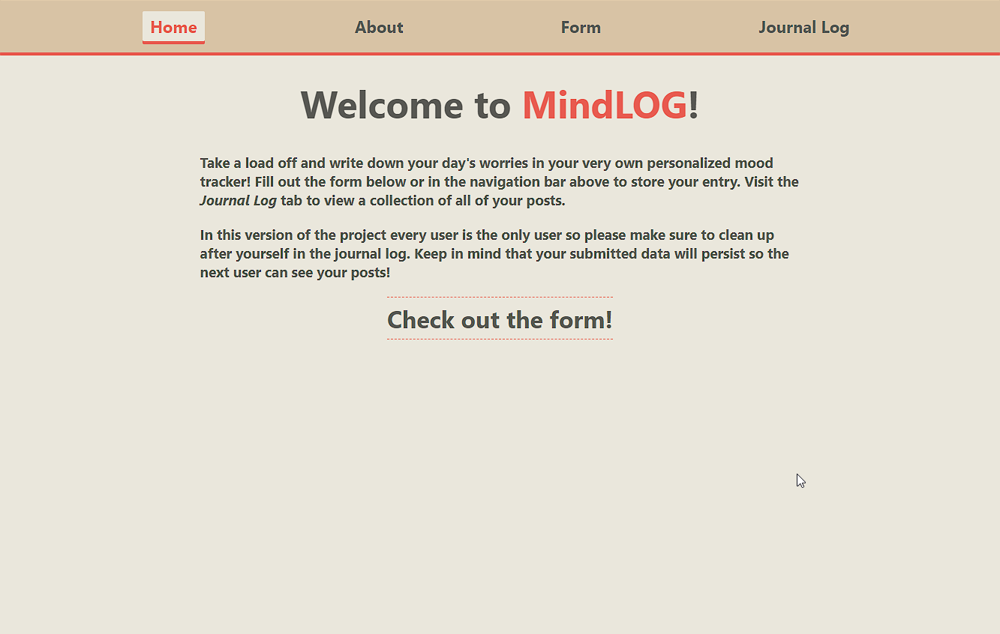
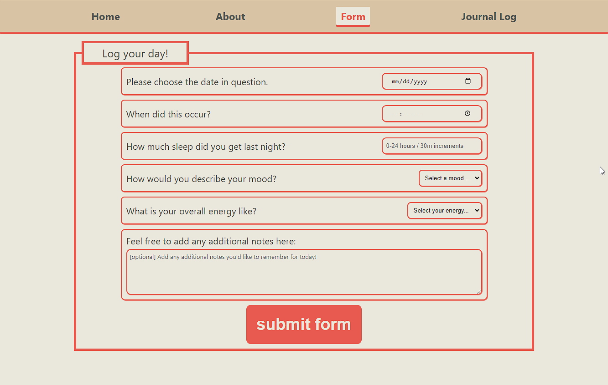
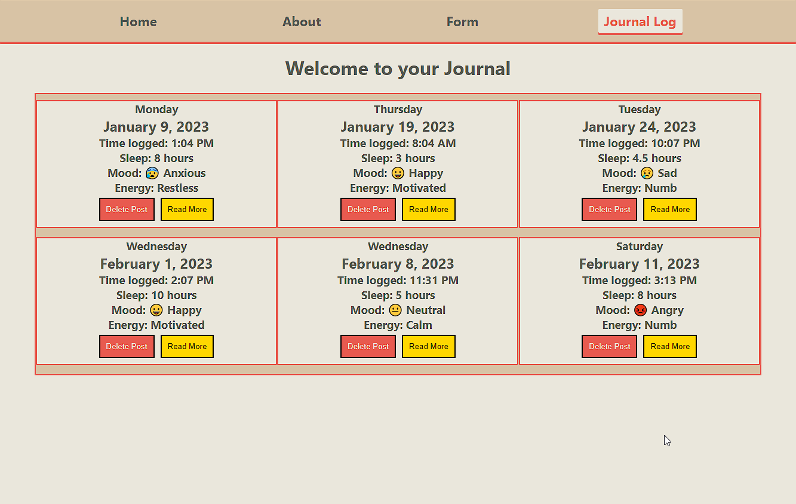
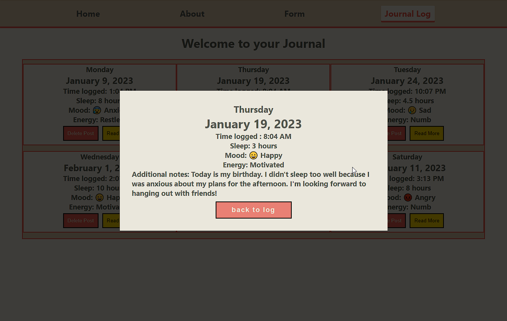
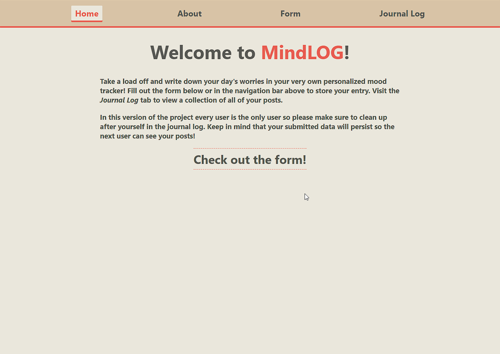

# MindLOG
## Welcome to my Phase 2 project at Flatiron School's Software Engineering Program!

---

## Description

Our phase 2 project required us to make a single page web app using React for the front end and then using a json-server for the backend.  We were tasked with creating a component tree, monitoring our state and props and presenting an app that allowed us to make POST and GET requests to our server.  

I once again took inspiration from my personal life in deciding what to do for this project. Over the years I've been a big proponent of journaling to help work through life's problems and after experimenting with some of the labs in this phase, as well as some brainstorming for the future phase 5 project, I felt like I had a clear direction.  I'm excited to see where this project will go in the future. Feel free to read more about this project and others at my [Medium blog](https://medium.com/@t.ismailgeci/phase-2-jumping-into-the-deep-end-of-the-frontend-with-react-6222906491a3).

---
## Deployment

[Render](https://render.com/) is handling the backend of the app by hosting the db.json file.
[Netlify](https://docs.netlify.com/#get-started) is handling the frontend.
MindLOG is currently being hosted [here](https://mindlog.netlify.app/).

---
## App usage with screenshots

Here is the main landing page of the app:

---

Users can access this form component either through the NavBar at the top of the page or by clicking the button on the home page:

---

Once users fill out the controlled form their data will be posted to the db.json file.  The submit button on the form also automatically redirects the user to the Log page.

---

Users can then press the 'Read More' button on each post to see a larger version of that post as well as the additional notes tab.

---

Here is a gif displaying the full app in motion including the POST, GET and DELETE methods:

---
## Credits

This project was bootstrapped with [Create React App](https://github.com/facebook/create-react-app).
The updated [favicon](https://icons8.com/icons/set/mind--c-e85a4f) was provided by [Icons8](https://icons8.com/).